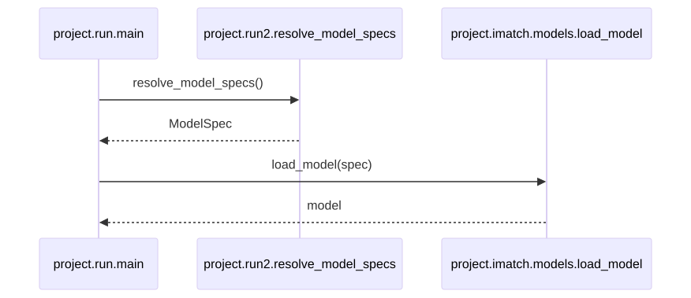
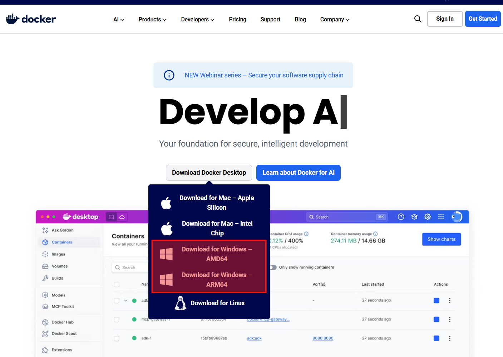
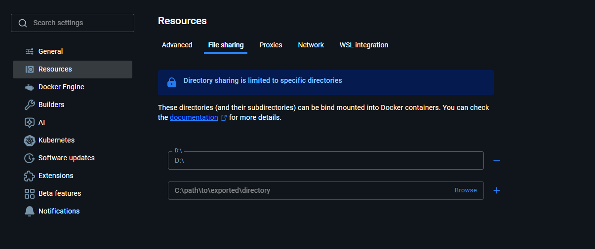
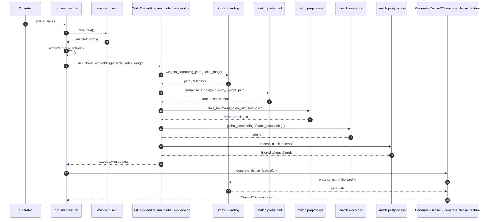
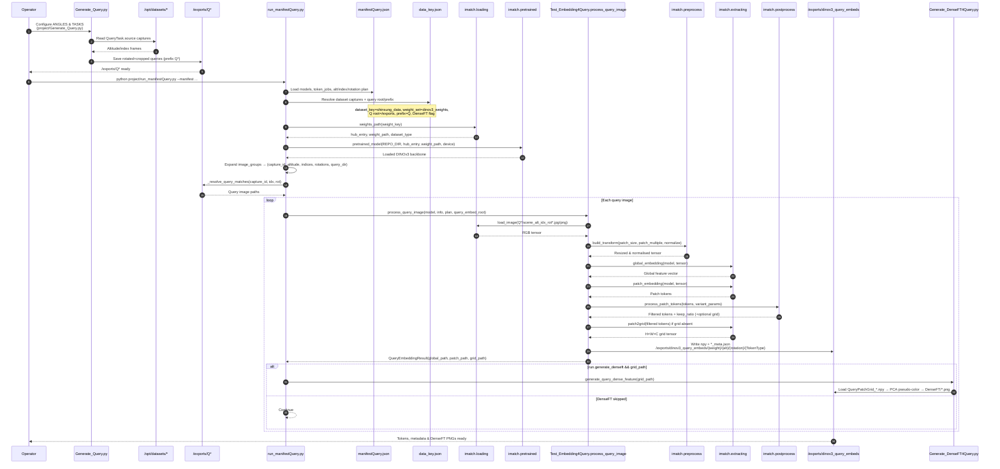

# DINOv3 Image Matching (Docker)

Docker Desktop 위에서 DINOv3 기반 이미지 매칭과 시각화를 수행하기 위한 프로젝트.  
컨테이너 안에서는 1:1 매칭을 수행하도록 구성되어 있으며, 결과(JSON/PNG)는 호스트의 지정된 디렉터리에 저장.

<p align="center">
  
</p>
<p align="center"><em>전체 코드의 호출, 의존관계 시퀀스 다이어그램</em></p>


---

## 0) 요구 사항

- **Windows 11** + **Docker Desktop (v.4.46.0 이상)**  
  - Docker Desktop 환경에서 동작.  
  - Docker Desktop Settings → Resources → File Sharing 에서 프로젝트/데이터 폴더가 공유되어 있는지 확인.
- **NVIDIA GPU & 최신 드라이버** (CUDA 12.x 호환)
- **NVIDIA Container Toolkit** (Docker Desktop 설치 시 자동 포함)
- 권장 체크 명령
  ```powershell
  docker --version
  nvidia-smi
  ```


### 0-1) Docker Desktop 설치
- 개인 PC 운영체제에 맞는 Docker Desktop 다운로드 후 설치 
- 본 프로젝트는 `4.46.0` 버전 사용

- 개인 PC 시스템 환경 확인
```powershell
Get-CimInstance Win32_Processor | Select-Object -ExpandProperty Architecture
```

  > _출력결과_:
  ```powershell
  # x64 (AMD64)
  9 

  # ARM64
  12
  ```

- Docker Desktop 설치: 
  > https://www.docker.com/

<p align="center">
  
</p>
<p align="center"><em>(출력결과 9: AMD64 설치, 출력결과 12: ARM64 설치)</em></p>
<p align="center"><em>대부분 Desktop/노트북은 x64(AMD64), Intel CPU사용하더라도 AMD64를 받는것이 일반적</em></p>


### 0-2) Docker Desktop 설치 후 기본 설정
- Docker Desktop 실행 → 리소스 제한 (CPU/Memory) → WSL2 (Windows) 연동 등 환경 설정 확인
- 프로젝트에 필요한 GPU 관련 드라이버/Container Runtime(NVIDIA Container toolkit) 설치

### 0-3) 프로젝트 디렉터리 준비
- 로컬 경로를 미리 생성한다.\
  작업할 디렉토리: `<Your>\<Project>\<Directory>` 로 가정\
  활용 데이터셋 디렉토리: `<Your>\<Datasets>\<Directory>`로 분리\
  작업 결과 디렉토리: `<Your>\<Project_Exports>\<Directory>`로 분리\

  
  ```bash
  mkdir <Your>\<Project>\<Directory>\dinov3_main      # 본 프로젝트 경로
  mkdir <Your>\<Project>\<Directory>\dinov3_src       # DINOv3
  mkdir <Your>\<Project>\<Directory>\dinov3_weights   # DINOv3에서 제공한 백본 경로
  mkdir <Your>\<Datasets>\<Directory>\dinov_data      # 활용할 입력 데이터셋 경로
  mkdir <Your>\<Project_Exports>\<Directory>\dinov3_exports   # 본 프로젝트의 출력 저장 경로
  ```

- 그리고 Docker Desktop에 Docker Desktop Settings → Resources → File Sharing 에서 프로젝트/데이터 폴더가 공유되어 있는지 확인
<p align="center">
  
</p>
<p align="center"><em>File Sharing에서 프로젝트/데이터 폴더가 공유되어 있는지 확인 (본 프로젝트는 D:에 공유됨)</em></p>


### 0-4) 환경 변수 파일 작성
- `.env.example` 파일을 이용하여 `.env` 파일을 생성해야 한다.
- `.env.example` 파일을 `.env` 파일명으로 복사:
  ```bash
  cp .env.example .env
  ```

- `.env`파일을 연다.
- 건드려야 할 곳은 `호스트 경로` 부분 5군데이다. 나머지는 건들지 않는 곳.

  `.env`에서 자신의 환경에 맞게 수정. 모든 경로는 **Windows 경로**로 작성.

  | 변수 | 설명 | 예시 (Windows) |
  | --- | --- | --- |
  | `PROJECT_HOST` | `project/` 폴더 실경로 | `D:\GoogleDrive\KNK_Lab\_Projects\dinov3_main\project` |
  | `CODE_HOST` | dinov3 원본 리포지터리 | `D:\GoogleDrive\KNK_Lab\_Projects\dinov3_src` |
  | `WEIGHTS_HOST` | `.pth` 가중치 루트 | `D:\GoogleDrive\KNK_Lab\_Projects\dinov3_weights` |
| `DATASET_HOST` | 이미지 데이터셋 루트 | `D:\Datasets\dinov_data` |
| `EXPORT_HOST` | JSON/PNG 결과 저장 루트 | `D:\Project_Exports\dinov3_exports` |


### 0-5) Docker Compose 빌드 단계
- 본격적으로 docker로 사용하기에 앞서 프로젝트 루트에서  `docker compose build` 실행.
  ```powershell
  docker compose build
  ```
  
  * 그러면 빌드 하면서 마지막에 
  ```powershell
  [+] Building 1/1
  ✔ dinov3:cuda12.1-py310  Built
  ```

### 0-6) Docker 컨테이너 실행 및 확인
- Docker 컨테이너 실행:
  ```powershell
  docker compose up -d
  ```
  
  * 그러면 컨테이너가 실행 준비 완료 되었다는 것을 다음과 같이 나온다:
  ```powershell
  [+] Running 2/2
  ✔ Network dinov3_main_default  Created                   0.0s 
  ✔ Container dinov3-matching    Started                   0.5s 
  ```

- 컨테이너 실행 하는지 확인:
  ```powershell
  docker compose ps
  ```

  * 그려면 아래와 같이 나옴:
  ```bash
  NAME              IMAGE                   COMMAND                   SERVICE    CREATED         STATUS         PORTS
  dinov3-matching   dinov3:cuda12.1-py310   "bash -lc 'sleep inf…"   matching   8 seconds ago   Up 7 seconds
  ```

### 0-7) Docker 초기 진입/테스트 
- 컨테이너 쉘 진입하여 기본 매칭/시각화 명령을 한번씩 수행하고, 결과 파일이 HOST경로에 생성되는지 확인:
  ```powershell
  docker compose exec matching bash
  ```
  
  * 그러면 아래와 같이 나오면 컨테이너 쉘 진입 확인 완료
  ```powershell
  root@{...}:/workspace/project#
  ```
  * `exit` 명령어로 쉘 나오기
  ```powershell
  root@{...}:/workspace/project# exit
  ```

- GPU 인식 체크로 드라이버/Toolkit 연동 상태 확인
  ```powershell
  docker compose exec matching nvidia-smi
  ```
  * `NVIDIA-SMI ~ Driver Version ~` 등 뜨면 정상적으로 Toolkit 연동

---

## 1) 저장소 구조 & 필수 리소스

- 아래와 같이 `dinov3_main` 의 디렉터리는 다음과 같이 있어야 한다.

```bash
dinov3_main/
├─ project/
│  ├─ imatch/           # 라이브러리 모듈
│  ├─ run.py            # 매칭 실행 엔트리
│  └─ visualize.py      # 시각화 엔트리
├─ Dockerfile
├─ docker-compose.yml
├─ requirements.txt
├─ .env
├─ .env.example
└─ README.md
```

필수 리소스 (작업할 디렉토리: `<Your>\<Project>\<Directory>` 라고 가정)
- **본 실행 프로젝트**  
  > _예시 위치:_ `<Your>\<Project>\<Directory>\dinov3_main`

- **facebookresearch/dinov3** 저장소 (코드 참조용)  
  > _예시 위치:_ `<Your>\<Project>\<Directory>\dinov3_src`

- **사전 학습 가중치(.pth)**  
  > _예시 위치:_ `<Your>\<Project>\<Directory>\dinov3_weights`

- **매칭 대상 이미지 데이터셋**  
  > _예시 위치:_ `<Your>\<Datasets>\<Directory>\dinov_data`

- **결과 저장 디렉터리**  
  > _예시 위치:_ `<Your>\<Project_Exports>\<Directory>\dinov3_exports`


### 1-1) 프로젝트 저장


- 작업하고자 하는 디렉토리(_`<Your>\<Project>\<Directory>`_)에 먼저 접근하여 본 프로젝트를 `dinov3_main` 하위 경로에 clone한다. 

  ```Bash
  git clone https://github.com/ZachNK/ImgMatching_DINOv3.git .\dinov3_main
  ```

### 1-2) DINOv3 원본 저장


- 작업할 경로 (_`<Your>\<Project>\<Directory>`_)에서 `dinov3_src` 하위 경로에 DINOv3 원본을 저장한다.

  ```Bash
  git clone https://github.com/facebookresearch/dinov3.git .\dinov3_src
  ```

### 1-3) 백본 백본 준비 

- _`<Your>\<Project>\<Directory>`_ 경로에 `dinov3_weights` 디렉토리에 백본 데이터를 준비 한다.\
  https://github.com/facebookresearch/dinov3에 게시된 가중치를 `dinov3_weights`에 바로 저장한다.

- `dinov3_weights`에는 백본 종류별로 다시 디렉토리를 생성해야 한다:
  ```bash
  # dinov3_weights에 디렉토리 추가 생성
  New-Item -ItemType Directory -Path <Your>\<Project>\<Directory>\dinov3_weights\01_ViT_LVD-1689M -ErrorAction SilentlyContinue
  New-Item -ItemType Directory -Path <Your>\<Project>\<Directory>\dinov3_weights\02_ConvNeXT_LVD-1689M -ErrorAction SilentlyContinue
  New-Item -ItemType Directory -Path <Your>\<Project>\<Directory>\dinov3_weights\03_ViT_SAT-493M -ErrorAction SilentlyContinue
  ```

* 각 세부 디렉토리별로 pth 파일들을 이동한다 
  (아래는 CLI명령 예시)
  ```powershell
  # dinov3_weights 디렉토리에 저장된 .pth 파일들 데이터셋별로 정리

  # 1) dinov3_weights\01_ViT_LVD-1689M에 파일 이동 (ViT-S/16 distilled 이동할 때)
  Move-Item -Path <Your>\<Project>\<Directory>\dinov3_vits16_pretrain_lvd1689m-08c60483.pth -Destination <Your>\<Project>\<Directory>\dinov3_weights\01_ViT_LVD-1689M

  # ... 나머지 ViT-S+/16 distilled, ViT-B/16 distilled 등 .pth파일 이동

  # 2) dinov3_weights\02_ConvNeXT_LVD-1689M에 파일 이동 (ConvNeXt Tiny 이동할 때)
  Move-Item -Path <Your>\<Project>\<Directory>\dinov3_convnext_tiny_pretrain_lvd1689m-21b726bb.pth -Destination <Your>\<Project>\<Directory>\dinov3_weights\01_ViT_LVD-1689M

  # ... 나머지 ConvNeXt Small, ConvNeXt Base 등 .pth파일 이동

  # 3) dinov3_weights\03_ViT_SAT-493M에 파일 이동 (ViT-L/16 distilled 이동할 때)
  Move-Item -Path <Your>\<Project>\<Directory>\dinov3_vitl16_pretrain_sat493m-eadcf0ff.pth -Destination <Your>\<Project>\<Directory>\dinov3_weights\01_ViT_LVD-1689M

  # ... 나머지 dinov3_vit7b16_pretrain_sat493m-a6675841.pth .pth파일 이동
  ```


### 1-4) 데이터셋 준비

- 데이터셋은 `dinov_data`의 디렉토리를 본 프로젝트를 수행하는 경로와 다른 곳에 저장한다. (저장하는 데이터셋, 임베딩 파일 및 쿼리 이미지 용량이 매우 크기 때문에, 적절히 메모리 환경이 충분한 곳에 골라 저장)

- 본 프로젝트의 저장 경로를 `<Your>\<Project>\<Directory>`라 한다면, 본 프로젝트에 활용할 데이터셋의 경로는 `<Your>\<Datasets>\<Directory>`에 저장함. 

- `dinov_data` 경로에 활용할 데이터셋은 아래와 같이 일관된 경로로 수정해야 한다.\
  `<ID>`는 세부 데이터셋 명이고, `<ALT>`는 항공 사진의 고도, `<FRAME>`은 해당 고도에서 촬영한 이미지 순번.

  ```bash
  <Your>\<Datasets>\<Directory>\dinov_data
    └─<Your>\<Datasets>\<Directory>\dinov_data\<ID>_<ALT>
        └─<Your>\<Datasets>\<Directory>\dinov_data\<ID>_<ALT>\<ID>_<ALT>_<FRAME>.jpg
  ```

- 본 프로젝트의 데이터셋 경로 예시
  ```bash
  D:\dinov_data
    └─D:\dinov_data\250912143954_450
        └─D:\dinov_data\250912143954_450\250912143954_450_0001.jpg
  ```

### 1-5) 디렉토리 최종

- 본 프로젝트 `dinov3_main`에서 실행한 후 도출한 결과들을 저장할 디렉토리 `dinov3_exports`에 생성한다.\
  최종 경로 상태는 아래와 같다:

  ```text
  <Your>\<Project>\<Directory>\
  ├─ dinov3_main\
  │  ├─ project\
  │  │  ├─ __pycache__\  
  │  │  ├─ imatch\
  │  │  │  ├─ extracting.py
  │  │  │  ├─ loading.py
  │  │  │  ├─ matching.py
  │  │  │  └─ ...
  │  │  ├─ json\
  │  │  │  ├─ data_key.json
  │  │  │  └─ manifest.json
  │  │  ├─ analyze_rotaion_similarity.py
  │  │  ├─ Generate_DenseFT.py
  │  │  ├─ Generate_Query.py
  │  │  ├─ run_Img2DenseFT.py
  │  │  ├─ run_manifest.py
  │  │  └─ ...
  │  ├─ Dockerfile
  │  ├─ docker-compose.yml
  │  ├─ requirements.txt
  │  ├─ .env
  │  ├─ .env.example
  │  └─ README.md
  ├─ dinov3_src\                 # facebookresearch/dinov3 clone
  │  ├─ .github
  │  ├─ __pycache__  
  │  ├─ dinov3  
  │  ├─ notebooks  
  │  ├─ .docstr.yaml
  │  └─ hubconf.py 등...
  ├─ dinov3_weights\
  │  ├─ 01_ViT_LVD-1689M\
  │  │  └─ *.pth
  │  ├─ 02_ConvNeXT_LVD-1689M\
  │  │  └─ *.pth
  │  └─ … (필요한 가중치별 디렉터리)

  <Your>\<Datasets>\<Directory>\
  └─ dinov_data\                # 매칭 대상 이미지/데이터셋
    └─ … (프로젝트별 입력 데이터)

  <Your>\<Project_Exports>\<Directory>\
  └─ dinov3_exports\             # 결과(JSON/PNG/npy) 저장
    ├─ dinov3_embeds\
    ├─ pair_match\
    └─ pair_vis\
  ```

---

## 2) Docker 이미지 빌드 & 컨테이너 실행

```powershell
docker compose build        # Dockerfile 변경 시 재빌드
docker compose up -d        # 컨테이너 백그라운드 실행
docker compose ps           # 상태 확인
```

변경 사항 적용 또는 `.env`를 수정한 뒤에는 `docker compose up -d --force-recreate`로 재생성.  
GPU가 인식되는지 확인:

```powershell
docker compose exec matching nvidia-smi
```

---

## 3) 임베딩

매칭이나 시각화 이전에 재사용 가능한 DINOv3 임베딩을 생성. \
컨테이너 내부의 모든 저장 파일들은 `/exports/...`에 생성. \
호스트는 `<Your>\<Project_Exports>\<Directory>\dinov3_exports`에 마운트.

### 3-1) 임베딩 파이프라인

## 원본 이미지 데이터셋 임베딩 파이프라인 (Sequence Diagram)




## 쿼리 이미지 임베딩 파이프라인 (Sequence Diagram)




### 3-2) 토큰 종류와 출력 구성

- 파일명 규칙: `{TokenType}_{embedding_cfg}_{variant}_{hub_entry}_{dataset_type}_{altitude}_{index}`. Query 출력은 `{scene}_{altitude}_{index}_{tag}`를 덧붙임.
- `_meta.json`은 기본 파일명에 `_meta`만 추가한 형태.
- DenseFT PNG는 `Generate_DenseFT.py`(dataset) 또는 `Generate_DenseFT4Query.py`(query)로 PatchGrid를 변환하고, 이후 `files.dense_vis` 슬롯에서 참조.

| 토큰 종류 | 파일 | 설명 | 호스트 경로 예시 |
| --- | --- | --- | --- |
| `GlobalToken` | `.npy`, `_meta.json` (query는 `.csv` 추가) | CLS/global 벡터를 저장 | `<Your>\<Project_Exports>\<Directory>\dinov3_exports\dinov3_embeds\<weight>\<altitude>\GlobalToken_` |
| `PatchToken` | `.npy`, `_meta.json` | 평탄화된 패치 토큰 (N × C 텐서) | `<Your>\<Project_Exports>\<Directory>\dinov3_exports\dinov3_embeds\<weight>\<altitude>\PatchToken` |
| `PatchGrid` | `.npy`, `_meta.json` | 패치 토큰을 H × W × C 그리드로 재배열 | `<Your>\<Project_Exports>\<Directory>\dinov3_exports\dinov3_embeds\<weight>\<altitude>\PatchGrid` |
| `DenseFT` | `.png` | PatchGrid에서 파생된 PCA 기반 밀집 특성 시각화 | `<Your>\<Project_Exports>\<Directory>\dinov3_exports\dinov3_embeds\<weight>\<altitude>\DenseFT` |
| `Query*` | `.npy`, `_meta.json`, Global `.csv` | 회전/크롭된 query 이미지 임베딩 | `<Your>\<Project_Exports>\<Directory>\dinov3_exports\dinov3_query_embeds\Q<weight_key>\<query_dir>` |


아티팩트 디렉터리 예시는 아래 구조를 따른다.

```text
<Your>\<Project_Exports>\<Directory>\dinov3_exports
├─ dinov3_embeds
│  └─ vitl16
│     └─ 450
│        ├─ GlobalToken
│        │  ├─ GlobalToken_res1024_ImageNet_raw_dinov3_vitl16_SAT_450_0001.npy
│        │  └─ GlobalToken_res1024_ImageNet_raw_dinov3_vitl16_SAT_450_0001_meta.json
│        ├─ PatchToken
│        ├─ PatchGrid
│        └─ DenseFT
└─ dinov3_query_embeds
   └─ Qvitb16
      └─ Q250912161658_200
         ├─ QueryGlobal_*.npy /.csv / _meta.json
         ├─ QueryPatchToken_*.npy / _meta.json
         └─ QueryPatchGrid_*.npy / _meta.json
```

Query PatchGrid 텐서에서 생성된 Dense feature PNG는 `<Your>\<Project_Exports>\<Directory>\dinov3_exports\dinov3_vis\Q<weight_key>\<query_dir>` 아래에 위치.

### 3-3) 실행 스크립트와 주요 파라미터

- `project/Test_Embedding.py`: \
  임베딩 핵심 실행 스크립트. \
  파라미터 `altitude`/`index`/`weight`의 조합으로 `run_global_embedding()`을 실행하여 `Global`/`Patch`/`PatchGrid` 토큰 파일 (`.npy`) 생성.

- `project/run_manifest.py`: \
  일괄 임베딩 실행 할 파라미터 조합 json파일. \
  `project/json/manifest.json`에서 모든 파라미터 설정값들을 지정하여 임베딩 일괄 수행. \
  `manifest.json`의 `models.token_jobs`에서 각 패치타입 별 `run` 부분에:\
  `test_embedding: true` → `Test_Embedding.py`를 호출하여 실행.\
  `generate_denseft: true` → `Generate_DenseFT.py` 호출까지 이어지는 실행 스크립트.

- `project/Test_Embedding4Query.py`:\
  `/exports/Q...`(호스트의 경우: e.g. `<Your>\<Project_Exports>\<Directory>\dinov3_exports\Q250912161658_200` )를 순회하며 query 이미지별 `QueryGlobal`/`QueryPatch`/`QueryPatchGrid` 토큰 파일(`.npy`) 출력.
- `project/Generate_DenseFT.py`, `project/Generate_DenseFT4Query.py`: PatchGrid 텐서를 1024×1024 PCA 사영 PNG로 변환해 dataset/query 시각화를 만듦.
- 보조 도구들(`Generate_Query.py`, `Test_Embedding4Query.py` 등)은 `imatch.loading` 경로 상수를 사용하므로 `.env`에 `DATASET_HOST`, `EXPORT_HOST` 등 유효한 변수를 반드시 지정.

배치 실행 예시:

```powershell
docker compose exec matching python project/run_manifest.py --manifest project/json/manifest.json
```

실행 예시:

```powershell
docker compose exec matching python -c "from Test_Embedding import run_global_embedding; run_global_embedding(altitude=400, index=1, weight='vitl16', target_res=1024, variant='mutual', variant_params={'norm_threshold':0.8})"
```

`run_global_embedding()`의 주요 인자:

| 인자 | 용도 | 비고 |
| --- | --- | --- |
| `altitude` | `data_key.json`에 등록된 촬영 고도 | 예: `400` |
| `index` | 고도 내 프레임 인덱스 | `1` → `_0001` |
| `weight` | `weight_key` (`vitb16`, `vitl16`, `cxTiny`, …) | `/opt/weights` 매핑 |
| `target_res` | 입력 이미지를 리사이즈할 해상도 | 기본 `1024`, PatchGrid에 영향 |
| `variant` | 패치 토큰 후처리(`raw`, `mutual`, `topk`, `subsample`, …) | `process_patch_tokens()` 구현 참고 |
| `embedding_cfg` | 파일명에 삽입할 선택적 레이블 | 기본 `res{target_res}_ImageNet` |
| `variant_params` | variant 기본값을 덮어쓰는 dict | 예: `{"topk": 256}` |
| `output_plan` | 어떤 아티팩트를 남길지 제어 | `{global|patch|grid: {"npy": bool, "json": bool}}` |

`run_manifest.py` 역시 `jobs[].embedding` 아래에서 동일한 옵션을 노출하며, `generate_denseft`를 켜면 DenseFT 생성까지 연속 실행. Query 임베딩은 `Test_Embedding4Query.py` 안의 `QUERY_DIRS`, `VAR_WEIGHT_KEYS`, `VARIANT`, `VARIANT_PARAMS`를 수정해 제어.

### 3-4) 패치 토큰 변형

`imatch/postprocess.py`에 등록된 전략은 다음과 같다.

| Variant | 기본 파라미터 | 동작 | 출력 영향 |
| --- | --- | --- | --- |
| `raw` | 없음 | 모든 패치 토큰을 유지 | `keep_ratio = 1.0`, PatchGrid 크기 유지 |
| `mutual` | `norm_threshold = 0.75` | Norm이 낮은 토큰을 제거(mutual-kNN proxy) | `matching_count`/`mutual_knn_tokens`로 생존 토큰 기록 |
| `topk` | `topk = 128` | Norm이 가장 높은 `k`개의 토큰 선택 | `params.topk`와 실제 토큰 수를 로그 |
| `subsample` | `stride = 2` | 재구성된 그리드에서 스트라이드 샘플링 | `grid_shape`와 `keep_ratio`로 축소 해상도 기재 |

단일 실행에서는 `variant_params`, 배치에서는 manifest `params`로 위 기본값을 덮어쓸 수 있으며, 적용 결과는 `_meta.json`의 비율 정보로 빠르게 확인 가능.

### 3-5) 메타데이터 스키마

모든 `_meta.json`은 동일한 구조를 사용한다.

```json
{
  "run_id": "GlobalToken_res1024_ImageNet_raw_dinov3_vitl16_SAT_400_0001",
  "token_type": "GlobalToken",
  "config": { ... },
  "files": { ... },
  "metrics": { ... },
  "timing_ms": { ... },
  "resources": { ... }
}
```

- `config`: `embedding_cfg`, `variant`, `variant_params`, `weight_id`, `dataset_type`, `altitude`, `index`, `prefix`, `target_res`, `rotations`, `aggregation` 등 임베딩 파라미터를 보관. Query 출력에는 `query.source_file`, `query.tag`, `query.query_dir`도 포함.
- `files`: 생성된 자산 위치.

| 키 | 의미 |
| --- | --- |
| `vector` | Global/Patch/Grid/Query의 주 텐서 `.npy` |
| `csv` | Query 파이프라인에서 사용하는 Global 토큰 CSV |
| `patch_tokens` | Patch token `.npy` 경로 |
| `patch_grid` | Query PatchGrid `.npy` 경로 |
| `dense_vis` | DenseFT PNG 참조 |
| `index` | 추후 ANN/Faiss 인덱스 용 슬롯 |

- `metrics`: Global 토큰은 `token_count = 1`로 고정하며, Patch 토큰은 `token_count`, `embedding_dim`, `matching_count`, `mutual_knn_tokens`, `keep_ratio`를 기록. PatchGrid는 여기에 `grid_shape` 및 파생 카운트를 추가하고, `recall@k`, `mAP`, `top1_precision` 등의 슬롯은 후속 실험용으로 비워둠.
- `timing_ms`: `global_forward`, `patch_forward`, `postprocess`, `index_build`, `query`, `pipeline_total` 시간을 저장.
- `resources`: `gpu_peak_mem_mb`, `embedding_storage_bytes`, `index_size_bytes` 등 리소스 메트릭(향후 확장)을 위한 공간.

Query 메타(`QueryGlobal_*_meta.json`, `QueryPatchToken_*_meta.json`)도 동일한 스키마를 따르며 항상 `config.query`와 `files.csv`를 채운다. DenseFT PNG를 생성한 뒤에는 `.npy`와 같은 위치에 두고, 추적이 필요하면 `files.dense_vis`를 업데이트.

> **참고**: 매칭/시각화 파트는 흐름이 안정화된 이후 다시 문서화될 예정이며, 현재 README는 임베딩 단계만 다룬다.


